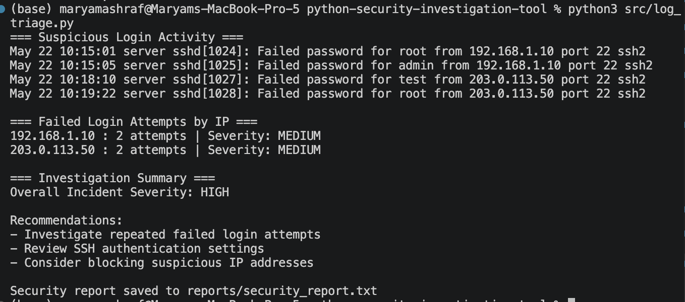
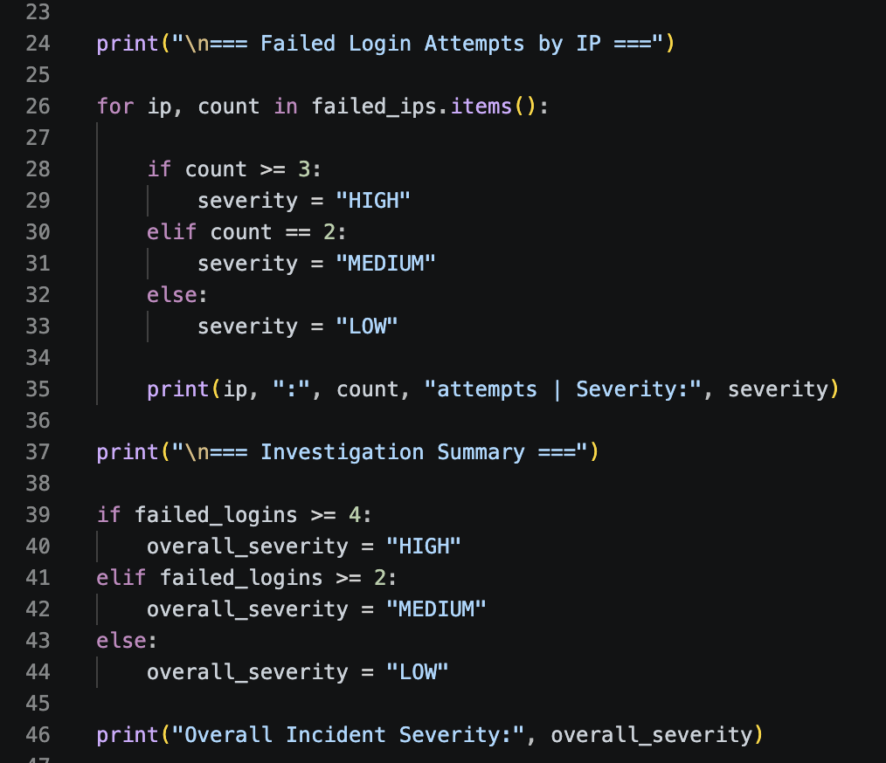
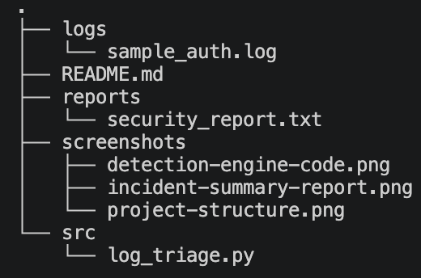

# Python Security Investigation Tool

Python-based security investigation and log triage tool designed to identify suspicious SSH authentication activity, classify incident severity, and automatically generate investigation reports.

---

# Project Overview

This project simulates a lightweight SOC-style investigation workflow by analyzing Linux authentication log entries for failed SSH login attempts.

The tool:
- Detects suspicious login activity
- Counts failed login attempts
- Tracks attacker IP addresses
- Assigns severity levels
- Generates automated investigation reports
- Provides remediation recommendations

This project was built to strengthen practical Python skills while learning security operations, log analysis, and defensive investigation workflows.

---

# Features

- SSH failed login detection
- Suspicious IP tracking
- Severity classification engine
- Automated investigation summary
- Report generation to text files
- Organized security project structure
- Beginner-friendly Python implementation

---

# Technologies Used

- Python 3
- VS Code
- macOS Terminal
- Git & GitHub

---

# Project Structure

```text
.
├── logs
│   └── sample_auth.log
├── README.md
├── reports
│   └── security_report.txt
├── screenshots
│   ├── detection-engine-code.png
│   ├── incident-summary-report.png
│   └── project-structure.png
└── src
    └── log_triage.py
```

---

# How It Works

The tool reads authentication log entries from:

```text
logs/sample_auth.log
```

It scans for:

```text
Failed password
```

entries commonly associated with:
- brute-force attacks
- unauthorized SSH access attempts
- suspicious authentication behavior

The program then:
1. Extracts IP addresses
2. Counts failed login attempts
3. Assigns severity levels
4. Generates an investigation summary
5. Saves a report file automatically

---

# Running the Tool

Run the script using:

```bash
python3 src/log_triage.py
```

---

# Example Output

```text
=== Suspicious Login Activity ===

Failed password for root from 192.168.1.10
Failed password for admin from 192.168.1.10
Failed password for test from 203.0.113.50
Failed password for root from 203.0.113.50

=== Failed Login Attempts by IP ===

192.168.1.10 : 2 attempts | Severity: MEDIUM
203.0.113.50 : 2 attempts | Severity: MEDIUM

=== Investigation Summary ===

Overall Incident Severity: HIGH
```

---

# Generated Investigation Report

The tool automatically creates:

```text
reports/security_report.txt
```

This report contains:
- overall incident severity
- failed login statistics
- suspicious IP activity
- investigation recommendations

---

# Screenshots

## Investigation Summary Output



---

## Detection Logic



---

## Project Structure



---

# Security Concepts Practiced

- Log analysis
- Authentication monitoring
- SSH investigation workflows
- Brute-force attack detection
- Incident severity classification
- Security automation
- Defensive security operations

---

# Future Improvements

- Real Linux auth.log ingestion
- CSV and JSON export support
- Threat intelligence integration
- Real-time monitoring
- Command-line arguments
- Web dashboard
- AI-assisted investigation summaries
- Brute-force pattern detection

---

# Key Takeaways

This project strengthened my understanding of:
- Python scripting for cybersecurity
- Security investigation workflows
- Log triage and incident analysis
- Automation in defensive security operations
- Structuring real-world cybersecurity projects

It also improved my confidence working with terminal-based development environments and practical security-focused Python workflows.